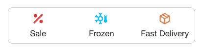

# Shopgate Connect - Extension PDP Highlights

This extension enhances the Product Detail Page by letting you spotlight key product attributes with customizable icons and labels. Specifically:
- **Dynamic badges**: Automatically display an icon + label whenever a product’s properties or tags match your configured rules (e.g. "New Arrival",  "Best Seller")
- **Static badges**: Define universal icons + labels that appear on every product (for messages like "Free Shipping", "Secure Checkout" etc.)

Default layout and styling can be adjusted via extension config settings.




### Configuration

#### highlights (object[])
The highlights setting allows to configure a list of highlights that are supposed to be displayed in different circumstances. The maximum amount of highlights to be displayed at a time can be configured via the `maxDisplayCount` setting. (*default*: `[]`)

Each entry has a `type` property with `static`, `property` and `tag` as possible values
- `static` highlights are displayed on every PDP
- `property` highlights are visible when the currently visible product has a property that matches the config of the `property` (object) - see example
- `tag` highlights are visible when the currently visible product matches the value of the `tag` property (string) - see example

Each entry can be configured with a `content` property (object) that can contain an `icon` property (string) that contains an SVG path and a `text` property (string) for the highlight label.

Additionally it's possible to configured the individual styling of each highlight via the `style` property (object).

##### Example
```json
{
  "highlights": [
    {
      "type": "static",
      "content": {
        "icon": "<path />",
        "text": "Static Highlight"
      },
      "style": {
        "& svg path": {
          "stroke": "#23401f"
        },
        "& svg": {
          "fill": "none"
        }
      }
    },
    {
      "type": "property",
      "property": {
        "label": "Property Label",
        "value": "Property Value",
      },
      "content": {
        "icon": "<path />",
        "text": "Property Highlight"
      },
      "style": {
        "textAlign": "center"
      }
    },
    {
      "type": "tag",
      "tag": "Tag Value",
      "content": {
        "icon": "<path />",
        "text": "Tag Highlight"
      },
    }
  ]
}
```

#### portalPosition (string)
The portal position where the product highlights are supposed to be shown (*default*: `product.header.after`).

Possible portal positions are: `product.header.before`, `product.header.before`, `product.header.after`, `product.variant-select.before`, `product.variant-select.after`, `product.description.before`, `product.description.after`, `product.properties.before`, `product.properties.after`

##### Example
```json
{
  "portalPosition": "product.description.before"
}
```

#### maxDisplayCount (number)
Maximum amount of highlights to be shown. By default 3 highlights are shown in a row (*default*: `3`).

##### Example
```json
{
  "maxDisplayCount": 3
}
```

#### containerStyle (object)
Additional styling applied to the container of the highlights. Also supports styling for the container children (*default*: `null`).

##### Example
```json
{
  "containerStyle": {
    "border": "1px solid grey",
    "padding": "8px",
    "& svg path": {
      "stroke": "#23401f"
    },
    "& svg": {
      "fill": "none"
    }
  }
}
```

#### highlightStyle (object)
Additional styling applied to each highlight. Also supports styling for the highlight children (*default*: `null`).

##### Example
```json
{
  "highlightStyle": {
    "color": "#23401f",
    "& svg path": {
      "stroke": "#23401f"
    },
    "& svg": {
      "fill": "none"
    }
  }
}
```

### Example

```json
{
  "highlights": [
    {
      "type": "static",
      "content": {
        "icon": "<path />",
        "text": "Static Highlight"
      },
      "style": {
        "& svg path": {
          "stroke": "#23401f"
        },
        "& svg": {
          "fill": "none"
        }
      }
    },
    {
      "type": "property",
      "property": {
        "label": "Property Label",
        "value": "Property Value",
      },
      "content": {
        "icon": "<path />",
        "text": "Property Highlight"
      },
      "style": {
        "textAlign": "center"
      }
    },
    {
      "type": "tag",
      "tag": "Tag Value",
      "content": {
        "icon": "<path />",
        "text": "Tag Highlight"
      },
    }
  ],
  "portalPosition": "product.description.before",
  "maxDisplayCount": 2,
  "containerStyle": {
    "border": "1px solid grey",
    "padding": "8px",
    "& svg path": {
      "stroke": "#23401f"
    },
    "& svg": {
      "fill": "none"
    }
  },
  "highlightStyle": {
    "color": "red"
  }
}
```

## About Shopgate

Shopgate is the leading mobile commerce platform.

Shopgate offers everything online retailers need to be successful in mobile. Our leading
software-as-a-service (SaaS) enables online stores to easily create, maintain and optimize native
apps and mobile websites for the iPhone, iPad, Android smartphones and tablets.


## License

Shopgate Connect - Extension PDP Highlights is available under the Apache License, Version 2.0.

See the [LICENSE](./LICENSE) file for more information.

